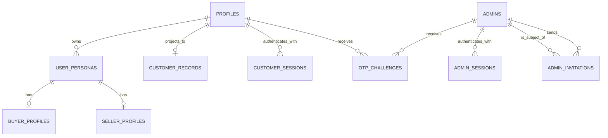
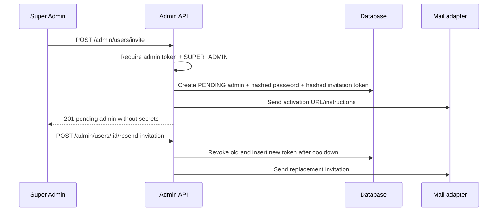
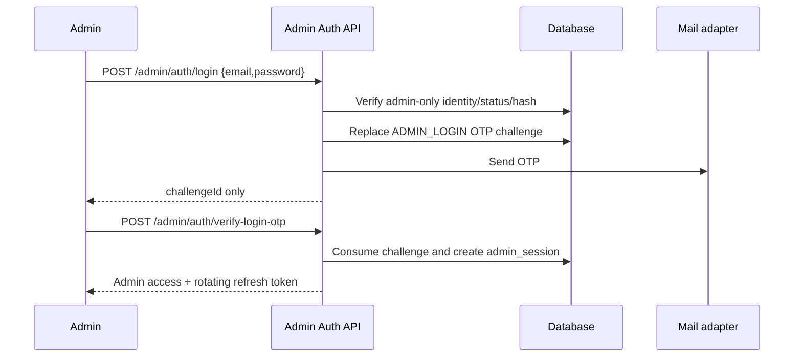

# Authentication and Onboarding Architecture

Status: additive architecture with the customer registration, verification,
onboarding, persona, session, recovery, and password vertical slices mounted as
of 3 August 2026. Admin authentication and staff-management contracts remain
design-only.

The mounted customer routes use an isolated customer access-token audience,
server-tracked hashed refresh sessions, rotation/reuse detection, and a verified
customer guard. Legacy routes that still use Supabase bearer tokens are unchanged.

Product branding: use **Beryl Shelter Nigeria Limited** for formal customer-facing
contexts and **Beryl Shelter** for compact UI labels. The `berylshelter.com`
domain configuration is provisional until ownership is confirmed.

## 1. Current-state summary

- Express 4 exposes `/api/v1`, a programmatic OpenAPI document at
  `/api-docs.json`, Swagger UI at `/api-docs`, and one global 200 requests/15
  minutes limiter.
- Controllers call services directly; services query Supabase directly. There is
  no repository layer or transaction abstraction.
- Customer registration (`POST /api/v1/auth/register`) creates a Supabase Auth
  user with `email_confirm: true`, then inserts a `profiles` row. It accepts
  first/last name, optional phone, one mutually exclusive legacy `role`, and
  personal/business profile type.
- Customer login accepts a normalized email or phone plus password, returns a
  custom customer access/refresh pair, and persists only the refresh-token hash.
  Refresh rotates the session atomically; logout revokes the bound session.
- `authMiddleware` accepts any valid Supabase access token. `requireRoles` then
  reads `profiles.role`; the same identity, token, middleware, and table protect
  customer and admin routes.
- Admin creation is an authenticated direct-create endpoint. It accepts a caller
  supplied password and immediately creates a confirmed, active user in the same
  Supabase/customer identity domain. There is no admin login route, invitation,
  activation, OTP challenge, department, or first-login restriction.
- The new customer password-change route requires the current password and
  revokes all customer sessions. Recovery uses a hashed email OTP followed by a
  short-lived, hashed, single-use reset proof. The legacy profile password route
  remains unchanged for compatibility.
- No email service, OTP implementation, database migrations, seed scripts, or
  committed tests existed at inspection time. The database shape can only be
  inferred from queries; it is not reproducible from this repository.
- Swagger is centralized in `src/config/swagger.ts`. It should only be updated
  when the corresponding route is mounted.

## 2. Gap analysis

| Area | Current implementation | Required change |
|---|---|---|
| Account identity | `profiles` plus one legacy `role` | One account with unique normalized email/phone and many persona rows |
| Registration | Missing required fields; email auto-confirmed | Pending account, strict validation, custom 6-digit email OTP |
| Verification | None | Hashed, expiring, 3-attempt, cooldown-controlled challenge and atomic activation |
| Personas/onboarding | One mutually exclusive role; shared profile fields | `user_personas`, buyer/seller profiles, independent status and active/last persona |
| Login | Email only; provider errors; no status/onboarding response | Normalized email/phone identifier, generic error, rate limit, restored persona and next action |
| Password recovery | None | Three-step OTP/proof/reset flow and session-version bump |
| Logout/change password | Logout is a no-op; current password not checked | Session revocation, current-password verification, password policy, invalidate other sessions |
| Customer projection | Admin reads every `profiles` row | Exactly one `customer_records` row per customer, joined with personas |
| Admin identity | Same table/token/middleware as customers | Separate `admins`, admin sessions, signing key/audience, middleware and routes |
| Admin lifecycle | Direct creation with request password | Super Admin invitation, resend, activation OTP, forced password establishment |
| Admin login | Same customer login; no OTP | Credential challenge then mandatory OTP before session issuance |
| Initial Super Admin | No seed | Environment-backed, idempotent seed with forced first password change |
| Sessions | Raw unmanaged Supabase response | Separate hashed rotating refresh sessions, short access tokens, version/revocation checks |
| Rate limiting | One coarse global limiter | Per-IP plus per-identity/challenge limits for every sensitive flow |
| Data integrity | Schema unavailable | Additive migration, unique/check constraints, RLS, indexes, later legacy backfill |
| Delivery/testing | No mail/test strategy | Mail adapter with safe local sink; unit/integration tests and migration CI |

## 3. Proposed domain model

`profiles` remains the customer account table during migration because all current
property and transaction foreign keys target it. It holds global account and
verification state, never persona-specific onboarding. The legacy `role` remains
temporarily for existing APIs but is not authoritative for new customer flows.

`user_personas` is the authoritative membership/state table. The unique
`(user_id, persona_type)` constraint makes activation idempotent. Buyer and seller
details are stored in separate one-to-one tables keyed by persona row. A customer
may therefore own both personas without overwriting either.

`customer_records` is a shared-database Admin Portal projection, not an API call
or queue. Its unique `user_id` guarantees exactly one record. Admin queries join
it to `profiles` and `user_personas` to expose name, identifiers, verification,
combined persona label, active persona, and timestamps. Verification uses
`INSERT ... ON CONFLICT (user_id) DO UPDATE`; persona activation updates the same
projection timestamp rather than inserting another row.

`admins` is a separate credential and lifecycle domain. It does not reference
`profiles` and cannot authenticate through customer middleware. Admin passwords
are application-hashed. Admin access/refresh tokens use a distinct secret,
audience, session table, and middleware.

### Entity rules

| Entity | Key/ownership | Important constraints and indexes | Sensitive data/lifecycle |
|---|---|---|---|
| `profiles` | UUID = customer Supabase Auth ID | normalized email unique; phone unique; status/persona enums; `session_version > 0` | global account only; legacy role retained temporarily |
| `user_personas` | UUID; FK `user_id -> profiles` cascade | unique `(user_id, persona_type)`; user index | independent onboarding state/completed timestamp |
| `buyer_profiles` | PK/FK `user_persona_id` cascade | non-empty locations; nonnegative/ordered budgets | Buyer data only |
| `seller_profiles` | PK/FK `user_persona_id` cascade | BUSINESS requires name/address | Seller/Developer data only |
| `customer_records` | UUID; FK `user_id -> profiles` restrict | unique `user_id` | shared Admin Portal projection anchor |
| `otp_challenges` | UUID; exactly one customer/admin subject | one live challenge per subject/purpose; expiry lookup indexes; max attempts | keyed OTP hash and reset/activation proof hashes only; single-use timestamps |
| `customer_sessions` | UUID; FK customer cascade | unique refresh hash; live-session index | refresh hash, rotation link, revocation and version |
| `admins` | UUID, separate identity | normalized email unique; optional phone unique; explicit status/role/department | scrypt password hash; password-change flag; session version |
| `admin_invitations` | UUID; FK invited admin and inviter | unique token hash; one pending invite/admin; expiry index | high-entropy token hash only; used/revoked timestamps |
| `admin_sessions` | UUID; FK admin cascade | unique refresh hash; live-session index | separate refresh hash, rotation/revocation/version |

Security tables have RLS enabled with no direct anon/authenticated PostgREST
policies. Express accesses them with the service-role client only after its own
authentication and authorization checks. The project does not currently use
soft deletion; explicit status/revocation timestamps are used instead.

## 4. Entity relationships



## 5. Customer registration and verification

```mermaid
sequenceDiagram
  participant C as Client
  participant A as API
  participant DB as PostgreSQL/Supabase
  participant M as Mail adapter
  C->>A: POST /auth/register
  A->>A: Normalize and validate; rate-limit
  A->>DB: Uniqueness check; create pending auth/account
  A->>DB: Replace live CUSTOMER_EMAIL_VERIFICATION OTP
  A->>M: Send six-digit OTP
  A-->>C: 201 PENDING_VERIFICATION, next=VERIFY_EMAIL
  C->>A: POST /auth/verify-email
  A->>DB: Lock challenge; verify hash/expiry/attempts
  A->>DB: Atomic activate + persona upsert + customer_records upsert
  A-->>C: 200 account/personas/onboarding/next action
```

Registration persists neither `confirmPassword` nor an OTP value. New Supabase
Auth users must be created unconfirmed and must not receive an application
session until the custom verification transaction succeeds. Duplicate email or
phone returns `409` with a stable `ACCOUNT_ALREADY_EXISTS` code and guidance to
login/reset, without creating partial records. If DB insert fails after managed
Auth creation, delete the new Auth identity as current code does; the stronger
phase-2 implementation is a compensating operation plus an idempotency key.

OTP generation uses `randomInt(0, 1_000_000).toString().padStart(6, "0")`.
Because six digits have low entropy, store a keyed HMAC of
`challengeId|purpose|otp` using `OTP_HASH_SECRET`, not a plain SHA-256 hash.
Verification locks the row, increments attempts on failure, consumes on success,
and invalidates a previous live challenge before replacement. Default expiry is
10 minutes, resend cooldown 60 seconds, and maximum attempts 3.

## 6. Customer onboarding

```mermaid
sequenceDiagram
  participant C as Client
  participant A as Customer API
  participant DB as Database
  C->>A: GET /onboarding/status
  A->>DB: Read all persona states
  A-->>C: per-persona status + nextRequiredAction
  C->>A: PATCH /onboarding/buyer or /seller
  A->>DB: Verify persona ownership; upsert profile
  A->>DB: Mark only that persona COMPLETED
  A-->>C: dashboard context or next action
```

Buyer locations are a non-empty, trimmed, case-insensitively deduplicated array
of at most 10 values; currency defaults to NGN. Seller BUSINESS requires company
name/address; INDIVIDUAL stores both as null. Either onboarding flow may receive
only `{ "skip": true }`, which completes that persona without deleting it or
creating invalid profile data. Closing the app does not lose state: the status
endpoint recomputes the next action from stored persona status.

## 7. Persona activation and switching

```mermaid
sequenceDiagram
  participant C as Client
  participant A as Customer API
  participant DB as Database
  C->>A: POST /personas/activate {personaType}
  A->>DB: INSERT user_personas ON CONFLICT DO NOTHING
  A->>DB: Set active/last persona; touch same customer record
  A-->>C: personas + persona onboarding action
  C->>A: PATCH /personas/active {personaType}
  A->>DB: Assert membership then update active/last
  A-->>C: dashboardContext + current persona
```

Activation never requests global account fields. Switching to an inactive
persona is `409 PERSONA_NOT_ACTIVATED`. Dashboard contexts are `BUYER_DASHBOARD` and
`SELLER_DEVELOPER_DASHBOARD`, unless onboarding is pending, in which case the
onboarding action wins.

## 8. Customer forgot-password, change, and logout

```mermaid
sequenceDiagram
  participant C as Client
  participant A as Customer API
  participant DB as Database
  C->>A: POST /auth/forgot-password {email}
  A-->>C: 202 generic acknowledgement
  A->>DB: Replace/send CUSTOMER_PASSWORD_RESET challenge if account exists
  C->>A: POST /auth/verify-password-reset-otp
  A->>DB: Consume OTP; store hash of short-lived reset proof
  A-->>C: resetToken (single-use, short-lived)
  C->>A: POST /auth/reset-password {resetToken,new password}
  A->>DB: Consume proof; change hash; increment version; revoke all sessions
  A-->>C: 200 LOGIN_REQUIRED
```

Authenticated password change first verifies the current password, rejects the
same password, changes it, increments `session_version`, and revokes all sessions
(optionally except the current request until its response completes). Logout
revokes only the current `sid`. Reset requests always return the same 202 body to
avoid account enumeration.

## 9. Admin invitation and activation



```mermaid
sequenceDiagram
  participant I as Invited Admin
  participant A as Admin Auth API
  participant DB as Database
  participant M as Mail adapter
  I->>A: POST /admin/auth/activate {token,temp password}
  A->>DB: Validate hashes/status/expiry; create ADMIN_ACTIVATION OTP
  A->>M: Send OTP
  A-->>I: activationChallengeId
  I->>A: POST /admin/auth/verify-activation-otp
  A->>DB: Consume OTP; create short activation proof
  A-->>I: activationProof
  I->>A: POST /admin/auth/set-password
  A->>DB: Consume proof; replace password; ACTIVE; invalidate invitation/OTP
  A-->>I: LOGIN_REQUIRED (no session)
```

Invitation tokens are at least 32 random bytes and stored as SHA-256 hashes.
Temporary passwords are generated with `randomBytes`, stored only as a scrypt
hash, and delivered only through the mail adapter. Production responses never
include either secret. A failed mail send leaves a visible pending record that a
Super Admin can resend; no external queue is introduced.

## 10. Admin login with mandatory OTP



Credential and OTP failures are generic. No admin session is issued before OTP.
Every fresh login creates a new challenge. A standard ADMIN receives 403 for
invitation/reset operations. Admin reset by a Super Admin increments the target's
session version, revokes sessions, and starts a secure set-password flow; no
public admin forgot-password route exists.

## 11. Super Admin first login

```mermaid
sequenceDiagram
  participant S as Seeded Super Admin
  participant A as Admin Auth API
  participant DB as Database
  S->>A: Email/password then login OTP
  A->>DB: Create restricted admin session
  A-->>S: nextRequiredAction=CHANGE_PASSWORD
  S->>A: POST /admin/auth/change-password
  A->>DB: Replace password; clear flag; bump version; revoke restricted session
  A-->>S: LOGIN_REQUIRED
  S->>A: Fresh password + fresh OTP login
  A-->>S: Dashboard-capable admin session
```

The seed uses `INITIAL_SUPER_ADMIN_PASSWORD`, normalized email
`berylsshelter@gmail.com`, and a unique-email lookup plus database unique
constraint. Reruns do not replace the password or create duplicates. A restricted
session has only the change-password capability; middleware blocks dashboard and
management routes while `requires_password_change` is true.

## 12. Session and token architecture

| Context | Access | Refresh | Required claims/storage |
|---|---|---|---|
| Customer | 15 minutes; `aud=beryl-customer`, `typ=customer_access` | 30 days, opaque random token, rotate every use | access: `sub`, `sid`, `ver`; DB stores refresh SHA-256 hash, expiry, version, rotation/revocation |
| Admin | 10 minutes; separately signed `aud=beryl-admin`, `typ=admin_access` | 7 days, opaque random token, rotate every use | access: `sub`, `sid`, `ver`; separate table/key; role/status fetched from DB |

Customer and admin signing secrets must differ. Middleware verifies signature,
audience/type, the matching session table, revocation/expiry, and current account
`session_version`. It never accepts a token from the other domain. Tokens contain
no password, OTP, phone, service key, or mutable profile data. Refresh rotation
atomically revokes the old row, links the replacement, and treats reuse of an old
refresh token as compromise warranting session-family revocation.

Logout revokes the current session. Password reset/change and Super Admin reset
increment version and revoke the required scope. The existing Supabase session
format remains supported on legacy endpoints during migration, but cannot satisfy
strong immediate revocation/audience isolation. The mounted customer auth,
onboarding, and persona routes use the new customer-session middleware.

## 13. API contracts

All paths below are under `/api/v1`. Success follows
`{ success: true, message, data }`; failures follow
`{ success: false, message, code?, errors? }`. No password, hash, OTP, invitation
token, refresh hash, or internal security field is serialized. Mutating endpoints
should accept an `Idempotency-Key` where noted.

### Customer authentication

| Method/path | Auth/validation | Success and status | Service/database impact | Errors/idempotency |
|---|---|---|---|---|
| `POST /auth/register` | Public; `customerRegisterSchema`; strict auth limiter | 201 account ID/status/`VERIFY_EMAIL` | pending managed identity/profile + replace OTP + mail | 400, 409 duplicate, 429; idempotency key recommended |
| `POST /auth/verify-email` | Public; normalized email + six digits | 200 account/personas/status/next | atomic challenge consume, activate, initial persona and customer upserts | 400/expired, 409 used, 429; repeat returns existing verified state |
| `POST /auth/resend-verification-otp` | Public; email | 202 cooldown timestamp | invalidate/replace live verification OTP + mail | 400 status, 429; never returns OTP |
| `POST /auth/login` | Public; identifier/password | 200 account/personas/current/onboarding/next + tokens | generic credential check; restore last active; create session | 401 generic, 403/409 verification action, 423 locked, 429 |
| `POST /auth/forgot-password` | Public; email | 202 generic acknowledgement | conditionally replace reset OTP + mail | always enumeration-safe; 429 |
| `POST /auth/verify-password-reset-otp` | Public; email/OTP | 200 short-lived reset token | consume OTP; store proof hash/expiry | 400/expired, 429; one proof per challenge |
| `POST /auth/reset-password` | Public; `resetToken`/`newPassword`/`confirmPassword` | 200 `LOGIN` next action | consume proof; set password; bump version; revoke all sessions | 400 policy, 401 proof, 409 used; replay safe |
| `POST /auth/refresh` | Customer refresh token | 200 rotated tokens | atomically rotate customer session | 401/409 reuse, 429 |
| `POST /auth/logout` | Customer access token + bound `refreshToken` body | 200 | revoke current `customer_sessions` row | idempotent |
| `PATCH /auth/change-password` | Customer access; current/new/confirm | 200 `LOGIN_REQUIRED` | verify old; set new; bump version; revoke sessions | 400 policy/same, 401 old password, 429 |

### Customer onboarding/personas

| Method/path | Auth/validation | Success and status | Service/database impact | Errors/idempotency |
|---|---|---|---|---|
| `GET /onboarding/status` | Customer access | 200 states/current/next | read personas and profiles | 401 only; safe |
| `PATCH /onboarding/buyer` | Customer access; `buyerOnboardingSchema` | 200 Buyer completed/next | require Buyer; upsert buyer profile; complete only Buyer | 400, 409 inactive; idempotent upsert |
| `PATCH /onboarding/seller` | Customer access; `sellerOnboardingSchema` | 200 Seller completed/next | require Seller; upsert seller profile; complete only Seller | 400, 409 inactive; idempotent upsert |
| `GET /personas` | Customer access | 200 active list/current/status | read only | 401 |
| `POST /personas/activate` | Customer access; `activatePersonaSchema` | 200/201 personas/current/next | persona insert-on-conflict; projection touch | 400; idempotent by unique constraint |
| `PATCH /personas/active` | Customer access; `switchPersonaSchema` | 200 current/dashboard context | membership check; update active/last | 409 not active; repeat safe |

### Admin authentication

| Method/path | Auth/validation | Success and status | Service/database impact | Errors/idempotency |
|---|---|---|---|---|
| `POST /admin/auth/login` | Public; `adminLoginSchema`; admin credential limiter | 202 challenge ID/expiry only | verify admin hash/status; replace login OTP; mail | 401 generic, 423, 429 |
| `POST /admin/auth/verify-login-otp` | Public; challenge UUID/OTP | 200 admin summary/next + tokens | consume challenge; create admin session (restricted if forced change) | 400/401 generic, 409 used, 429 |
| `POST /admin/auth/resend-login-otp` | Public; challenge UUID | 202 challenge/next resend time | enforce cooldown; invalidate/replace OTP | 400 state, 429 |
| `POST /admin/auth/activate` | Public; activation token/temp password | 202 activation challenge ID | verify invitation/password; issue activation OTP | 400/401 generic, 409 active, 410 expired, 429 |
| `POST /admin/auth/verify-activation-otp` | Public; challenge UUID/OTP | 200 activation proof | consume OTP; persist proof hash/expiry | 400, 409 used, 429 |
| `POST /admin/auth/set-password` | Public; proof/new/confirm | 200 `LOGIN_REQUIRED` | consume proof; ACTIVE; invalidate invitation/temp/OTP | 400, 401 proof, 409 used; replay safe |
| `POST /admin/auth/change-password` | Admin/restricted access; current/new/confirm | 200 `LOGIN_REQUIRED` | replace password; clear force flag; bump version; revoke sessions | 400, 401, 429 |
| `POST /admin/auth/refresh` | Admin refresh token | 200 rotated tokens | rotate only admin session | 401/409 reuse, 429 |
| `POST /admin/auth/logout` | Admin access | 200 | revoke current admin session | idempotent |

### Super Admin management

| Method/path | Auth/validation | Success and status | Service/database impact | Errors/idempotency |
|---|---|---|---|---|
| `POST /admin/users/invite` | Admin access + SUPER_ADMIN; `inviteAdminSchema` | 201 sanitized pending admin | insert pending admin/invite; send mail | 403 standard admin, 409 email, 429; idempotency key |
| `POST /admin/users/:adminId/resend-invitation` | SUPER_ADMIN; UUID | 202 sanitized invite state | revoke old; create replacement; mail | 403, 404, 409 state, 429 cooldown |
| `POST /admin/users/:adminId/reset-password` | SUPER_ADMIN; UUID | 202 reset-required state | temp/proof flow; force change; bump/revoke sessions | 403, 404, 409 target state, 429 |
| `GET /admin/users` | Admin access (policy decision: ADMIN read allowed) | 200 sanitized admin page | read `admins` | 401/403 |
| `GET /admin/users/:adminId` | Admin access | 200 sanitized admin | read `admins`; no hashes | 401/403/404 |
| `PATCH /admin/users/:adminId/status` | SUPER_ADMIN; status enum | 200 sanitized admin | status update; bump/revoke if disabling | 403, 404, 409 self/last-super-admin guard |

`GET /admin/users` permanently retains its current meaning in this API version:
it lists customer users managed through the Admin Portal. Admin staff-management
route naming is a separate product decision and is outside the customer
registration vertical slice.

Registration response example:

```json
{
  "success": true,
  "message": "Account created. Check your email for the verification code.",
  "data": {
    "verificationRequired": true,
    "maskedEmail": "c***r@example.com",
    "otpLength": 6,
    "resendAvailableIn": 60,
    "nextAction": "VERIFY_EMAIL"
  }
}
```

Login returns sanitized customer data, persona onboarding states,
`activePersona`, `nextAction`, `accessToken`, `refreshToken`, and both token
lifetimes in seconds.

## 14. Required environment variables

Existing Supabase, Cloudinary, port, and Node environment variables remain
unchanged. Public URLs must be configured through environment variables. The
provisional `berylshelter.com` values require product ownership confirmation:

| Variable | Purpose/default |
|---|---|
| `PUBLIC_WEB_URL` | Public web origin; provisional production value `https://berylshelter.com` |
| `API_PUBLIC_URL` | Public API origin; provisional production value `https://api.berylshelter.com` |
| `ADMIN_WEB_URL` | Admin web origin; provisional production value `https://admin.berylshelter.com` |

Legacy `CLIENT_WEB_URL` and `API_BASE_URL` values remain supported as fallbacks
during configuration migration. Add:

| Variable | Purpose/default |
|---|---|
| `INITIAL_SUPER_ADMIN_PASSWORD` | Required only for deployment seed; no default |
| `OTP_HASH_SECRET` | Required high-entropy keyed OTP/reset-proof hashing secret |
| `CUSTOMER_ACCESS_TOKEN_SECRET` | Required customer access-token signing key; minimum 32 characters |
| `CUSTOMER_REFRESH_TOKEN_SECRET` | Required distinct customer refresh-token signing key; minimum 32 characters |
| `CUSTOMER_ACCESS_TOKEN_EXPIRES_IN` | Access-token lifetime in seconds; 900 |
| `CUSTOMER_REFRESH_TOKEN_EXPIRES_IN` | Refresh-token lifetime in seconds; 2592000 |
| `CUSTOMER_PASSWORD_RESET_PROOF_EXPIRES_IN` | Reset-proof lifetime in seconds; 600 |
| `CUSTOMER_SESSION_TOKEN_SECRET` | Legacy fallback for `CUSTOMER_ACCESS_TOKEN_SECRET` during configuration migration |
| `ADMIN_SESSION_TOKEN_SECRET` | Required distinct admin access-token signing key |
| `CUSTOMER_ACCESS_TOKEN_MINUTES` | 15 |
| `CUSTOMER_REFRESH_TOKEN_DAYS` | 30 |
| `ADMIN_ACCESS_TOKEN_MINUTES` | 10 |
| `ADMIN_REFRESH_TOKEN_DAYS` | 7 |
| `OTP_EXPIRY_MINUTES` | 10 |
| `OTP_MAX_ATTEMPTS` | 3 |
| `OTP_RESEND_COOLDOWN_SECONDS` | 60 |
| `ADMIN_INVITATION_EXPIRY_HOURS` | 24 |
| `RESEND_API_KEY` | Required production Resend API credential |
| `RESEND_FROM_EMAIL` | Required verified Resend sender; `onboarding@resend.dev` may be used temporarily in development |
| `RESEND_FROM_NAME` | Required display name for verification email sender; use `Beryl Shelter Nigeria Limited` |
| `ADMIN_ACTIVATION_URL` | Frontend activation-link base URL |

The mounted registration and password-reset routes fail safely when their signing,
OTP, storage, or Resend configuration is unavailable; they never report false
delivery success. Customer access and refresh secrets must be different.

## 15. Migration strategy

1. Back up and query duplicate normalized emails/phones before applying the
   migration. The migration is additive and transactional; duplicate unique keys
   roll it back rather than silently merging accounts.
2. Apply `202607280001_auth_onboarding_foundation.sql` in staging. Validate RLS,
   foreign keys, check constraints, and indexes. It does not drop or rename data.
3. Decide the legacy role-to-persona mapping with product/data owners, then write
   a reviewed backfill. A suggested starting point is `investor -> BUYER` and
   `property_developer/landlord -> SELLER_DEVELOPER`; agent roles are ambiguous
   and must not be guessed.
4. Populate one `customer_records` row for genuine customers only. Do not project
   legacy admin/support rows.
5. Apply `202608030001_customer_onboarding_personas.sql` and
   `202608030002_customer_authentication_sessions.sql` in staging after the
   foundation/verification migrations. Review the service-role-only RPC grants,
   transaction behavior, and managed Auth password update against the target
   Supabase version before production.
6. Deploy new routes behind a feature flag, dual-read legacy customers, then
   migrate callers. Keep existing endpoints until compatibility is confirmed.
7. Run the Super Admin seed once per environment after the migration. Reruns are
   safe and do not change the existing password.

Preflight duplicate checks:

```sql
select lower(trim(email)), count(*) from profiles group by 1 having count(*) > 1;
select phone_number, count(*) from profiles where phone_number is not null group by 1 having count(*) > 1;
```

## 16. Security decisions

- Normalize before lookup and enforce uniqueness in PostgreSQL, not only Zod.
- Customer managed-auth passwords remain handled by Supabase until the custom
  session cutover. Admin hashes use Node `scrypt`; verification must parse fixed
  parameters and use `timingSafeEqual`.
- Use keyed OTP HMAC, high-entropy invitation/reset/refresh tokens, hash all
  bearer proofs at rest, and never log request bodies on auth routes.
- Apply endpoint-specific IP and normalized identity/challenge limits in addition
  to the global limiter. Store counters externally/DB for multi-instance deploys;
  in-memory Express limiting alone is insufficient.
- Use generic login/reset responses, explicit state codes, strict server-side
  authorization, and DB constraints. A standard ADMIN cannot invite/reset/change
  status of another admin.
- Emit audit events for admin invitation, resend, activation, login success/fail,
  reset, status change, persona activation, password/security changes, and
  session revocation without storing secrets.
- Mail is sent after committing durable pending state. Resend recovers delivery;
  no message queue is needed at current scale.

## 17. Exact implementation file plan

Foundational files already added:

- `src/modules/auth-onboarding/auth-onboarding.types.ts`
- `src/modules/auth-onboarding/normalization.ts`
- `src/modules/auth-onboarding/customer.validators.ts`
- `src/modules/auth-onboarding/admin.validators.ts`
- `src/modules/auth-onboarding/customer.validators.test.ts`
- `supabase/migrations/202607280001_auth_onboarding_foundation.sql`
- `src/scripts/seed-super-admin.ts`

Customer registration, onboarding/persona, customer-session, recovery/password,
mail, Swagger, and rate-limiter implementations now exist. Next implementation
work is the separate Admin authentication and staff-management slice. Existing
legacy `auth.*`, `admin.*`, `profile.*`, and role middleware still require
compatibility adapters rather than wholesale rewrites.

## 18. Implementation phases

1. **Database safety:** inspect live schema/duplicates, validate migration in
   staging, add RPC transaction tests, agree legacy mapping.
2. **Security primitives:** password/OTP/token hashing, mail adapter, rate limits,
   isolated token/session middleware, refresh rotation and audit logging.
3. **Customer vertical slice:** registration/verification, login/session,
   customer projection, persona/onboarding, recovery/password/logout; integration
   tests; then Swagger and feature-flagged mount.
4. **Admin vertical slice:** seed validation, invitation/resend/activation,
   mandatory login OTP, restricted first-login, reset/status management; tests;
   then Swagger and mount before protected admin router middleware.
5. **Compatibility migration:** customer-list route alias, legacy account backfill,
   consumers switched, legacy auth deprecation only after evidence of no use.

## 19. Risks and unresolved questions

- The live Supabase schema/migrations are absent, so column types, existing
  constraints, triggers, RLS policies, and duplicate identifiers must be checked
  before applying the draft migration.
- Legacy roles do not map cleanly to BUYER/SELLER_DEVELOPER, especially registered
  and freelance agents. Product/data owner approval is required for backfill.
- Existing admin identities in `profiles` need a one-time secure migration into
  `admins`; passwords cannot be copied from Supabase, so invitation/reset is
  required.
- Admin staff-management needs a distinct future route name or a versioned API;
  `/admin/users` is reserved for Admin Portal customer management.
- Mail provider, template ownership, delivery retry policy, frontend activation
  URL, and whether standard ADMIN may view all admins are not specified.
- The migration updates `auth.users.encrypted_password` inside service-role-only
  transactional RPCs. This preserves atomic session invalidation but requires
  explicit staging verification against the deployed Supabase Auth version.
